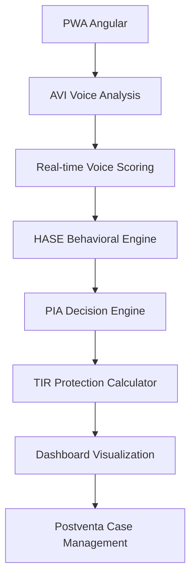

# 🚀 RAG Proactive Lab

**Ecosistema completo de inteligencia artificial para análisis de riesgo crediticio** que combina 6 agentes especializados para decisiones financieras más justas y precisas.

## 🎯 Resumen Ejecutivo

Este laboratorio integra **análisis de voz + comportamiento digital + decisión inteligente** para revolucionar la evaluación crediticia tradicional.

## Estructura

```
app/                     # FastAPI (webhooks, endpoints, prompts híbridos)
agents/
  pia/                   # Motor TIR, reglas, LLM service, contratos
  hase/                  # Scripts ingestión/agregación/entrenamiento score
scripts/                 # Herramientas de laboratorio (ingest, notifier, worker, smoke)
prompts/llm/             # Plantillas narrativas y de comportamiento
data/                    # Datasets dummy (PIA/HASE)
reports/                 # Notas, alertas, outbox y logs de LLM
docs/                    # Guías (smoke, orquestación)
```

## 🎯 ¿Qué es este laboratorio?

Este es un **ecosistema completo de inteligencia artificial** para análisis de riesgo crediticio que combina múltiples agentes especializados. Piensa en él como un "cerebro digital" que puede:

- 🎤 **Analizar tu voz** durante una entrevista (AVI)
- 📊 **Evaluar tu comportamiento** financiero (HASE)
- 💰 **Calcular escenarios** de protección financiera (TIR)
- 🤖 **Tomar decisiones** inteligentes sobre crédito (PIA)
- 📱 **Gestionar casos** de postventa
- 📈 **Visualizar resultados** en tiempo real (Dashboard)

## 🧠 Los 5 Agentes del Ecosistema

### 1. **AVI** - Tu Entrevistador Virtual 🎤
- **¿Qué hace?** Analiza tu voz durante una entrevista de 55 preguntas
- **¿Cómo funciona?** Detecta estrés, verifica consistencia, mide confianza
- **¿Por qué importa?** Tu voz revela patrones que los datos no muestran

### 2. **HASE** - El Motor de Scoring Hiperadaptativo 🔍
- **¿Qué hace?** Motor de scoring que se adapta en tiempo real a nuevos patrones
- **¿Cómo funciona?** Machine learning hiperadaptativo que evoluciona con cada decisión
- **¿Por qué importa?** Scoring que mejora continuamente y se adapta a cambios del mercado

### 3. **PIA** - El Tomador de Decisiones 🎯
- **¿Qué hace?** Combina AVI + HASE para decidir aprobaciones
- **¿Cómo funciona?** Motor de reglas + IA para decisiones finales
- **¿Por qué importa?** Decisiones más justas y explicables

### 4. **TIR/Protección** - El Calculador Financiero 💰
- **¿Qué hace?** Calcula escenarios de protección y reestructuras
- **¿Cómo funciona?** Algoritmos determinísticos de TIR mínima
- **¿Por qué importa?** Protege tanto al cliente como a la institución

### 5. **Agente de Postventa** - El Asistente Personal 📞
- **¿Qué hace?** Responde preguntas técnicas y gestiona casos
- **¿Cómo funciona?** RAG (retrieval) + LLM para respuestas contextúales
- **¿Por qué importa?** Soporte inteligente 24/7

## 🏗️ Arquitectura del Laboratorio

```
rag-proactive-lab/
├── avi_lab/            # 🎤 Análisis de voz inteligente
├── agents/
│   ├── hase/           # 🔍 Motor de scoring comportamental
│   └── pia/            # 🎯 Motor de decisión TIR/Protección
├── app/                # 🌐 API FastAPI (webhooks, endpoints)
├── dashboard/          # 📊 Dashboard React para visualización
├── scripts/            # ⚙️ Orquestadores de demo y herramientas
├── data/               # 📈 Datasets sintéticos del demo
├── docs/               # 📚 Documentación técnica y runbooks
└── pwa_angular/        # 📱 Interfaz de usuario Angular
```

## 🎬 El Flujo Completo (Para No Técnicos)

1. **Cliente entra al sistema** → Interfaz Angular PWA
2. **Se inicia entrevista AVI** → 55 preguntas de análisis vocal
3. **AVI analiza respuestas** → Detecta estrés, confianza, consistencia
4. **HASE evalúa comportamiento** → Analiza historial y patrones
5. **PIA toma decisión** → Combina AVI + HASE + reglas de negocio
6. **TIR calcula protección** → Escenarios financieros si es aprobado
7. **Dashboard muestra resultados** → Visualización en tiempo real
8. **Postventa gestiona seguimiento** → Asistencia continua

## 🔬 El Flujo Técnico (Para Desarrolladores)



## 📂 Alcance del repositorio

**🎯 Componentes Principales:**
- `avi_lab/` – PWA Angular para análisis de voz inteligente (55 preguntas estructuradas)
- `agents/hase/` – Motor de scoring con modelos ML entrenados (.joblib)
- `agents/pia/` – Motor de decisión TIR/Protección + reglas de negocio
- `app/` – API FastAPI con webhooks y endpoints de protección
- `dashboard/` – Dashboard React con visualizaciones en tiempo real
- `scripts/` – Orquestadores de demo (`make demo-proteccion`) y herramientas
- `docs/` – Documentación técnica, runbooks y HUs quirúrgicas
- `pwa_angular/` – Submódulo del bot de postventa (UI Angular)

**🔧 Archivos Críticos Incluidos:**
- `config/financial.yml` – Configuración de políticas TIR
- `migrations/*.sql` – Scripts de schema de base de datos
- `models/hase/*.joblib` – Modelos ML entrenados para scoring
- `tests/` – Suite completa de tests de regresión
- `src/components/` – Componentes React adicionales

**🚫 Excluidos (innecesarios para el laboratorio):**
- `.env`, `secrets.local.txt` – Credenciales y API keys (mantener en `sensibles.zip`)
- `logs/`, `__pycache__/` – Archivos temporales y cache
- `conductores/`, `pwa_angular-restored/`, `rag-pinecone/` – Carpetas de referencia/backup locales
- `notebooks/` – Directorios de desarrollo experimental
- `*2.py`, `*backup*` – Archivos duplicados y backups

> ✅ **El laboratorio está 100% funcional**: Cualquiera puede clonar, configurar variables de entorno, y ejecutar el demo completo.

## Demo Sintético Rápido

1. **Ejecutar demo completo**
   ```bash
   make demo-proteccion
   # opcional: make demo-proteccion ARGS="--llm --llm-limit 3"
   ```
   Genera la cartera sintética (`data/pia/synthetic_driver_states.csv`), outcomes (`data/pia/pia_outcomes_log.csv`), feature store (`data/hase/pia_outcomes_features.csv`) y resumen por plan (`reports/pia_plan_summary.csv`).

2. **Inspeccionar resultados**
   ```bash
   python3 scripts/pia_plan_summary_monitor.py
   ```
   Muestra alertas (planes expirados, revisión manual, protecciones negativas) directamente en consola.

3. **Alertas LLM (modo plantilla)**
   ```bash
   PIA_LLM_MODE=template PIA_LLM_ALERTS=1 \
   python3 scripts/pia_llm_notifier.py --limit 3 --skip-email \
     --pia-outbox reports/pia_llm_outbox.jsonl
   ```
   Esto deja narrativas proactivas listas para Make/n8n o dashboards.

### Documentación relacionada
- [Runbook HASE/PIA/TIR/Protección](docs/demo_runbook_hase_pia_tir_proteccion.md)
- [HUs quirúrgicas para dashboards](docs/hus_dashboard_proteccion.md)

### Datasets de laboratorio
| Archivo | Propósito |
| --- | --- |
| `data/pia/synthetic_driver_states.csv` | Snapshot de consumo, pagos, telemetría y banderas PIA/HASE por placa. |
| `data/pia/pia_outcomes_log.csv` | Log detallado de decisiones PIA y escenarios TIR evaluados. |
| `data/hase/pia_outcomes_features.csv` | Feature store para dashboards (protecciones restantes, outcomes por ventana, tags). |
| `reports/pia_plan_summary.csv` | Resumen por plan (conteos, protecciones disponibles, alertas). |
| `reports/pia_llm_outbox.jsonl` | Narrativas proactivas (si se habilita el LLM notifier). |

### Dashboard React
- UI demo en [`dashboard/`](dashboard/README.md).
- Sincroniza datasets con `npm run sync-data` (ver README del dashboard).
- Ejecuta `npm run dev` para levantar la experiencia en http://localhost:5173.

## Flujos principales

1. **Modo laboratorio**
   ```bash
   export PIA_LLM_MODE=template
   export PIA_LLM_CASE_NOTES=1
   export PIA_LLM_ALERTS=1
   export PIA_LLM_SUMMARIES=1
   export PIA_LLM_BEHAVIOUR=1

   python3 scripts/pia_generate_dummy_outcomes.py --reset-log
   python3 scripts/pia_smoke_dummy_requests.py --fail-on-error
   python3 scripts/pia_llm_notifier.py --limit 3 --email-to laboratorio@rag.mx --pia-outbox reports/pia_llm_outbox.jsonl
   ```

2. **Watcher / cron**
   ```bash
   python3 scripts/pia_llm_worker.py \
     --features data/hase/pia_outcomes_features.csv \
     --interval 60 \
     --notifier-args "--limit 3 --email-to laboratorio@rag.mx --pia-outbox reports/pia_llm_outbox.jsonl"
   ```

3. **Storytelling**
   ```bash
   curl -X POST http://localhost:8000/pia/protection/evaluate_with_summary \
     -H "Content-Type: application/json" \
     -d '{"market":"edomex","balance":520000,"payment":19000,"term_months":48,"metadata":{"placa":"DEMO-001"}}'
   ```

4. **Señales de comportamiento**
   - `_process_media_items` agrega `behaviour_tags/notes` cuando `PIA_LLM_BEHAVIOUR=1`.
   - `aggregate_outcomes` genera columnas `behaviour_tag_*_count`, `last_behaviour_tags`, `last_behaviour_notes` listas para HASE.

## Canales de entrega

- `scripts/pia_llm_notifier.py` envía alertas vía:
  - `--email-to`: correo (SMTP; fallback en `reports/pia_llm_email_fallback.log`).
  - `--pia-outbox`: JSONL (`reports/pia_llm_outbox.jsonl`) listo para que PIA/CRM entregue el mensaje.
- `scripts/pia_llm_worker.py` monitorea el CSV y dispara el notifier en loop.

## Componentes clave

- `app/api.py`: webhook WhatsApp, prompts híbridos, endpoints `/pia/protection/evaluate[_with_summary]`.
- `agents/pia/src/*`: motor TIR, contratos, LLM service (notas, alertas, comportamiento).
- `agents/hase/scripts/*`: ingestión/agregación entrena features + score.
- `docs/pia_protection_smoke.md`: guía paso a paso del flow sintético.

## Datos generados

- `reports/pia_case_notes/*.md` – nota de cada outcome.
- `reports/pia_llm_alerts.jsonl` – historial de alertas.
- `reports/pia_llm_outbox.jsonl` – mensajes listos para el operador.
- `data/hase/pia_outcomes_features.csv` – features agregadas con flags y comportamiento.
- `reports/pia_plan_summary.csv` – resumen por plan de protección.

## Modo OpenAI

Si quieres narrativas reales:
```bash
export OPENAI_API_KEY="sk-..."
export PIA_LLM_MODE=openai
```
(el resto del pipeline es igual; si no hay red, cae automáticamente al modo plantilla).

---

Con esto tienes una visión completa del laboratorio. A partir de aquí, puedes mantener el repo "central" con todo integrado y sincronizar sólo lo necesario a cada repo "ligero" (p. ej. el bot postventa) según lo vayas desplegando.
