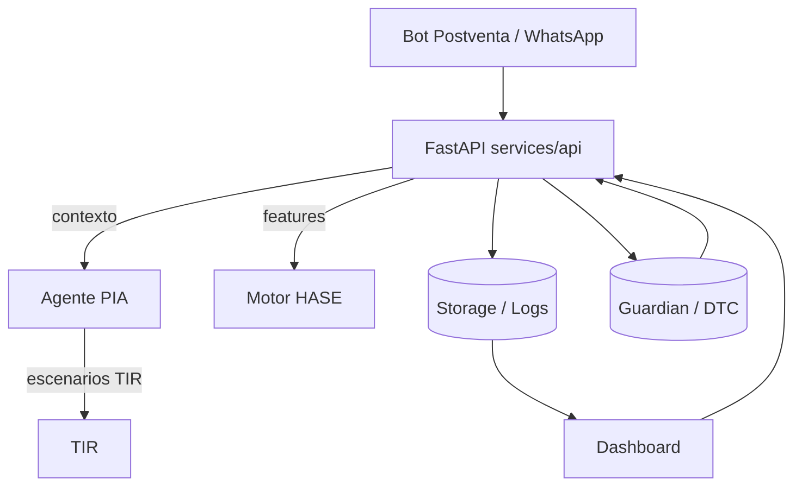

# 🧭 Arquitectura – RAG Proactive Lab

## Visión general

- **FastAPI (`services/api/api.py`)**: núcleo que expone endpoints, integra LLMs, ingestiones y orquesta a los agentes.
- **Agente PIA (`agents/pia/`)**: evalúa escenarios TIR, reglas y prompts LLM. Consume snapshots de HASE y configuraciones financieras.
- **HASE / Scoring (`data/hase/`, `pia_utils.py`)**: provee features en tiempo real para PIA y dashboards.
- **TIR**: parte del agente PIA (archivos `tir_equilibrium_*`). Calcula reestructuras y protección financiera.
- **Storage (`services/api/storage.py`)**: maneja logging, playbooks, cache de media y exportaciones. Apoya al bot postventa y al dashboard.
- **Guardian (`guardian/`)**: catálogos DTC, reportes y reglas de monitoreo; alimenta extractores de señales.
- **Dashboard React (`clients/dashboard/`)**: visualiza métricas de PIA/HASE/Guardian; sincroniza datos con scripts `sync-data`.
- **Bot Postventa (WhatsApp/Twilio)**: entrada principal de casos. Usa endpoints `/twilio/whatsapp`, pipelines de visión/audio y catálogos.

## Dependencias clave

| Componente | Dependencias |
| --- | --- |
| FastAPI | `agents/pia`, `services/api/*`, catálogos (`data/`, `guardian/`), `.env` |
| PIA | `config/financial.yml`, `data/hase/`, `data/pia/`, prompts `prompts/pia/` |
| HASE | Snapshots `data/hase/`, scripts `pia_utils` |
| Storage | Archivos en `logs/`, `data/dtc_catalog.json`, `playbooks.json` |
| Bot Postventa | FastAPI `/twilio`, storage, visión (`vision_openai.py`), audio (`audio_transcribe.py`), catálogos, playbooks |
| Dashboard | API `/pia/*`, `reports/*`, `clients/dashboard/src` |

## Flujo de build/test

1. `npm run build-safe` – empaqueta el dashboard React.
2. `npm run validate` – verifica dependencias de FastAPI.
3. `npm run test-safe` – ejecuta `pytest` sobre `services/api` y utilidades.
4. `npm run build-custom` – orquesta los tres pasos anteriores automáticamente.

## Archivos críticos

- `services/api/api.py`: Pipeline principal (Twilio, `/query`, `/pia/*`).
- `agents/pia/src/*`: Reglas, prompts y motor TIR.
- `services/api/storage.py`: Persistencia, cache y playbooks.
- `data/parts_equivalences.*`, `parts_index.json`: Catálogo de refacciones.
- `data/dtc_catalog.json`, `guardian/dtc_catalog.json`: Referencias DTC.
- `prompts/pia/`: Plantillas LLM para notificaciones y resúmenes.

## Notas operativas

- Nx está disponible pero el flujo recomendado usa `build-custom.js` por estabilidad.
- Ejecuta `npm run build-custom` antes de desplegar o abrir PRs.
- Mantén `sensibles.zip` actualizado con `.env` y `secrets.local.txt` para credenciales.
