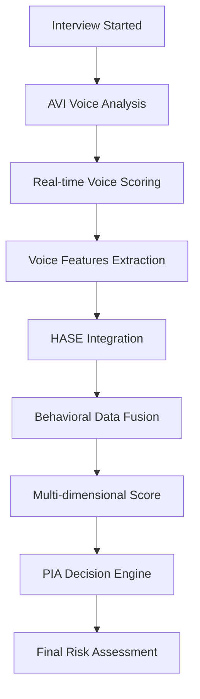

# AVI + HASE Scoring Architecture

## 🧠 Arquitectura de Scoring Integral

Este documento describe la integración entre **AVI (Análisis de Voz Inteligente)** y **HASE (Hybrid Assessment Scoring Engine)** para crear un sistema de evaluación de riesgo multidimensional.

## 🎯 Visión General

```
AVI (Voice Analysis) + HASE (Behavioral Signals) = Complete Risk Assessment
```

### Flujo de Datos Principal



## 🎤 AVI - Análisis de Voz Inteligente

### Capacidades Principales

#### 1. **Stress Detection**
- **Algoritmo**: Análisis de frecuencia vocal y patrones de entonación
- **Métricas**:
  - `averageStress`: Nivel promedio de estrés (0-1)
  - `peakStressPoints`: Momentos de máximo estrés
  - `stressTrend`: Tendencia durante la entrevista

#### 2. **Keyword Verification**
- **Función**: Verificación de consistencia en respuestas
- **Técnica**: Speech-to-text + análisis semántico
- **Output**:
  - `consistencyScore`: Coherencia en respuestas
  - `flagWordsDetected`: Palabras de riesgo identificadas
  - `confidenceKeywords`: Indicadores de confianza

#### 3. **Behavioral Pattern Analysis**
- **Métricas**:
  - `evasiveResponses`: Respuestas evasivas detectadas
  - `longPauses`: Pausas prolongadas
  - `speechSpeedVariance`: Variabilidad en velocidad de habla

### Dataset de 55 Preguntas

#### Categorías Estructuradas

| Categoría | Preguntas | Risk Weight | Propósito |
|-----------|-----------|-------------|-----------|
| **Historial Crediticio** | 8 | 0.8-0.9 | Evaluar experiencia crediticia previa |
| **Situación Financiera** | 7 | 0.6-0.85 | Analizar estabilidad económica actual |
| **Comportamiento de Pago** | 6 | 0.9-0.95 | Predecir patrones de pago futuros |
| **Estabilidad Laboral** | 5 | 0.7-0.8 | Verificar fuente de ingresos |
| **Planificación Financiera** | 6 | 0.6-0.75 | Evaluar capacidad de gestión |
| **Manejo de Crisis** | 8 | 0.8-0.95 | Analizar resilencia financiera |
| **Proyección Futura** | 7 | 0.65-0.8 | Evaluar visión a largo plazo |
| **Verificación de Identidad** | 8 | 0.4-0.6 | Confirmar datos básicos |

#### Modos Operacionales

1. **Demo Mode** (5 preguntas) - Demostración rápida
2. **Critical Questions** (12 preguntas) - Evaluación de riesgo clave
3. **High Stress Mode** (20 preguntas) - Análisis psicológico bajo presión
4. **Full Assessment** (55 preguntas) - Evaluación integral completa

## 📊 HASE - Hyperadaptive Scoring Engine

### Input de AVI

HASE recibe datos estructurados de AVI:

```typescript
interface HASEScorePayload {
  sessionId: string;
  overallScore: {
    voiceTrust: number;        // Confiabilidad vocal (0-1)
    stressRisk: number;        // Riesgo por estrés (0-1)
    consistency: number;       // Consistencia en respuestas (0-1)
    finalAviScore: number;     // Score final AVI (0-1)
  };
  riskFactors: {
    highStressResponses: number;   // Respuestas de alto estrés
    inconsistentAnswers: number;   // Respuestas inconsistentes
    evasiveBehavior: number;       // Comportamiento evasivo
    timeoutResponses: number;      // Respuestas con timeout
  };
  categoryScores: {
    [category: string]: number;    // Score por categoría
  };
  recommendations: string[];       // Recomendaciones específicas
}
```

### Fusion de Datos

HASE combina las señales de AVI con datos comportamentales existentes:

#### AVI Features → HASE Processing

| AVI Metric | HASE Feature | Weight | Impact |
|------------|--------------|--------|---------|
| `voiceTrust` | `voice_reliability_score` | 0.25 | Trust calculation |
| `stressRisk` | `stress_indicator` | 0.30 | Risk amplifier |
| `consistency` | `response_consistency` | 0.20 | Credibility factor |
| `evasiveBehavior` | `evasion_flag` | 0.25 | Red flag indicator |

### Algoritmo de Scoring Híbrido

```python
def calculate_hybrid_score(avi_payload, behavioral_data, transaction_history):
    """
    Calcula score híbrido integrando AVI + HASE
    """
    # Componente AVI (30% del score final)
    avi_component = (
        avi_payload['overallScore']['voiceTrust'] * 0.4 +
        (1 - avi_payload['overallScore']['stressRisk']) * 0.3 +
        avi_payload['overallScore']['consistency'] * 0.3
    ) * 0.30

    # Componente HASE tradicional (50% del score final)
    hase_component = calculate_behavioral_score(
        behavioral_data, transaction_history
    ) * 0.50

    # Factor de riesgo AVI (20% del score final)
    risk_factor = calculate_avi_risk_penalty(
        avi_payload['riskFactors']
    ) * 0.20

    # Score final híbrido
    hybrid_score = avi_component + hase_component - risk_factor

    return max(0, min(1, hybrid_score))
```

## 🔄 Pipeline de Integración

### 1. **Inicio de Entrevista**
```typescript
// AVI Lab inicializa sesión
const sessionId = aviService.initializeSession();
const selectedMode = 'CRITICAL_QUESTIONS'; // 12 preguntas clave
```

### 2. **Análisis en Tiempo Real**
```typescript
// Para cada pregunta
aviService.analyzeVoiceResponse(audioBlob, questionId)
  .subscribe(result => {
    // Actualizar métricas en tiempo real
    updateRealTimeMetrics(result);

    // Detectar flags críticos
    if (result.stressIndicators.averageStress > 0.8) {
      triggerHighRiskAlert();
    }
  });
```

### 3. **Generación de Payload HASE**
```typescript
// Al finalizar entrevista
const hasePayload = aviService.generateHASEPayload();

// Enviar a HASE para scoring
const hybridScore = await haseService.calculateHybridScore(
  hasePayload,
  customerBehavioralData,
  transactionHistory
);
```

### 4. **Decisión PIA**
```typescript
// PIA utiliza score híbrido para decisión final
const piaDecision = await piaAgent.makeDecision({
  hybridScore: hybridScore.finalScore,
  aviRecommendations: hasePayload.recommendations,
  riskFactors: hybridScore.detailedRiskFactors
});
```

## 📈 Métricas y Scoring

### Score Dimensions

#### 1. **Voice Trust Score** (AVI)
- **Range**: 0-1
- **Calculation**: Consistency + Confidence - Evasion
- **Impact**: Multiplica confiabilidad general

#### 2. **Stress Risk Score** (AVI)
- **Range**: 0-1
- **Calculation**: Stress patterns + Speech variance
- **Impact**: Amplificador de riesgo

#### 3. **Behavioral Score** (HASE)
- **Range**: 0-1
- **Calculation**: Payment history + Usage patterns
- **Impact**: Score base tradicional

#### 4. **Hybrid Final Score**
- **Formula**: `(Voice Trust * 0.3) + (Behavioral * 0.5) + ((1 - Stress Risk) * 0.2)`
- **Range**: 0-1
- **Interpretation**:
  - **0.8-1.0**: Muy bajo riesgo
  - **0.6-0.8**: Riesgo moderado
  - **0.4-0.6**: Riesgo alto
  - **0.0-0.4**: Riesgo muy alto

## 🚨 Alertas y Flags

### Flags Críticos AVI

1. **High Stress Alert**: `stressRisk > 0.8`
2. **Inconsistency Warning**: `consistency < 0.5`
3. **Evasion Detected**: `evasiveResponses > 3`
4. **Timeout Pattern**: `timeoutResponses > 40%`

### Acciones Automáticas

```typescript
interface AutomatedActions {
  highRiskDetected: () => void;     // Escalate to manual review
  inconsistencyFlag: () => void;    // Request additional verification
  stressAlert: () => void;          // Apply stress penalty
  evasionPattern: () => void;       // Mark for behavioral analysis
}
```

## 🔗 API Integration

### AVI → HASE Webhook
```http
POST /hase/voice-analysis
Content-Type: application/json

{
  "sessionId": "avi_1234567890_xyz",
  "customerPlaca": "ABC123",
  "aviPayload": { /* HASEScorePayload */ },
  "interviewMode": "CRITICAL_QUESTIONS",
  "timestamp": "2024-01-01T10:00:00Z"
}
```

### HASE Response
```json
{
  "hybridScore": {
    "finalScore": 0.73,
    "components": {
      "aviComponent": 0.68,
      "haseComponent": 0.81,
      "riskPenalty": 0.07
    },
    "confidence": 0.89,
    "recommendation": "APPROVE_WITH_CONDITIONS"
  },
  "detailedAnalysis": {
    "voiceTrustLevel": "HIGH",
    "stressRiskLevel": "MEDIUM",
    "behavioralConsistency": "HIGH",
    "overallRiskCategory": "MODERATE"
  }
}
```

## 🎯 Benefits del Sistema Híbrido

### 1. **Detección de Fraude**
- Voice patterns difíciles de falsificar
- Cross-validation entre voice y behavioral data
- Real-time fraud detection

### 2. **Evaluación Más Precisa**
- Múltiples dimensiones de análisis
- Reducción de falsos positivos
- Mayor granularidad en scoring

### 3. **Experiencia de Usuario**
- Evaluación más humana e interactiva
- Feedback inmediato
- Proceso más engaging

### 4. **Compliance y Auditabilidad**
- Trail completo de decisiones
- Explicabilidad del scoring
- Cumplimiento regulatorio

---

## 📚 Referencias Técnicas

- **AVI Implementation**: `/avi_lab/src/app/services/voice-analysis.service.ts`
- **HASE Integration**: `/agents/hase/src/service.py`
- **Dataset**: `/avi_lab/src/app/data/avi-questions-dataset.ts`
- **Dashboard Integration**: `/dashboard/src/components/`

**Parte del ecosistema [rag-proactive-lab](../README.md)**